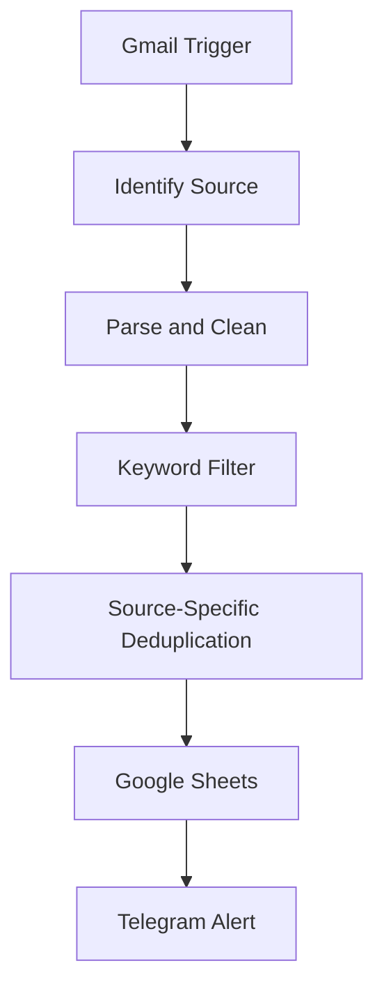
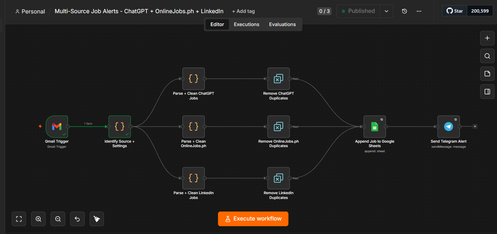
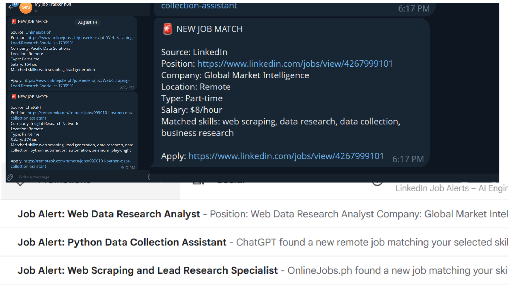

# Multi-Source Job Alert Automation

An n8n workflow that turns job-alert emails from multiple sources into clean, filtered, and deduplicated records in Google Sheets, then sends relevant opportunities to Telegram.

## The Problem

Manually checking several job platforms is repetitive and time-consuming. Relevant opportunities can be missed, and the same listing may be reviewed more than once.

Each source also uses a different email format. Without source-specific parsing, job titles, companies, locations, salaries, and application links can be extracted inconsistently.

## The Solution

This workflow monitors Gmail for job-alert emails and automatically:

1. Identifies the source of each alert.
2. Applies source-specific JavaScript parsing.
3. Cleans and normalizes the extracted data.
4. Filters jobs using selected skills and keywords.
5. Creates a unique deduplication key.
6. Checks duplicates separately for each source.
7. Saves only new, relevant jobs to Google Sheets.
8. Sends a Telegram notification with the job details and application link.

## Supported Sources

- LinkedIn job-alert emails
- OnlineJobs.ph job-alert emails
- Job alerts delivered through ChatGPT email notifications

The parsing logic can be extended to support other email-based job sources.

## Workflow Overview

## Workflow Preview

### Complete n8n Workflow

This screenshot shows the complete multi-source workflow and its successful execution paths.

### Successful Gmail-to-Telegram Result

This screenshot demonstrates a job-alert email being processed successfully and delivered as a Telegram notification.

> The workflow JSON is not publicly included to protect credentials, account identifiers, and private configuration. The screenshots show the workflow structure and working output without exposing sensitive information.

## Main Features

- Multi-source email monitoring
- Automatic source identification
- Source-specific JavaScript parsing
- Consistent data formatting
- Skill and keyword matching
- Platform-aware duplicate prevention
- Structured Google Sheets storage
- Instant Telegram notifications

## Google Sheets Fields

| Field | Description |
|---|---|
| `job_id` | Unique job identifier |
| `source` | LinkedIn, OnlineJobs.ph, or ChatGPT |
| `date_received` | Date the email was received |
| `position` | Job title |
| `company` | Company or client name |
| `location` | Job location or remote status |
| `job_type` | Full-time, part-time, contract, or project-based |
| `salary` | Salary or rate when available |
| `description` | Cleaned job summary |
| `job_url` | Application or listing URL |
| `matched_skills` | Keywords matched by the workflow |
| `email_subject` | Original email subject |
| `dedupe_key` | Key used to prevent duplicate records |
| `gmail_id` | Gmail message identifier |

A ready-to-copy header is available in [`docs/google-sheets-schema.csv`](docs/google-sheets-schema.csv).

## Setup

See [`SETUP.md`](SETUP.md) for credential, Gmail, Google Sheets, Telegram, keyword, and testing instructions.

## Testing

Sample test messages are available in [`samples/test-emails.md`](samples/test-emails.md). Each message uses a unique job ID and URL so it can pass the duplicate check during testing.

Recommended checks:

- Confirm each source follows the correct parser path.
- Confirm irrelevant jobs stop at the keyword filter.
- Confirm the first copy of a job reaches Google Sheets and Telegram.
- Send the same message again and confirm the duplicate is blocked.
- Verify that blank optional fields do not stop the workflow.

## Security

The public repository contains documentation and sanitized screenshots only. It does not include the exported n8n workflow JSON or private configuration.

Do not publish Gmail OAuth tokens, Telegram bot tokens, Google credentials, spreadsheet IDs, chat IDs, personal email addresses, or real applicant information. Read [`SECURITY.md`](SECURITY.md) before publishing.

## Built With

- n8n
- JavaScript
- Gmail
- Google Sheets
- Telegram

## Business Value

- Reduces repetitive job searching
- Helps surface relevant opportunities faster
- Keeps job data clean and organized
- Prevents repeated processing of the same listing
- Creates a reusable foundation for other alert and lead-monitoring systems

## Future Improvements

- Add more job-alert sources
- Add AI-assisted job scoring
- Add configurable keywords without editing code
- Add error alerts and execution logging
- Add a dashboard for application status tracking

## Author

**Antonio Mandia Jr.**  
Automation, web scraping, and data collection projects

Open to freelance, part-time, and project-based opportunities involving n8n automation, web scraping, data collection, and workflow improvement.

## License

This project is available under the [MIT License](LICENSE).
